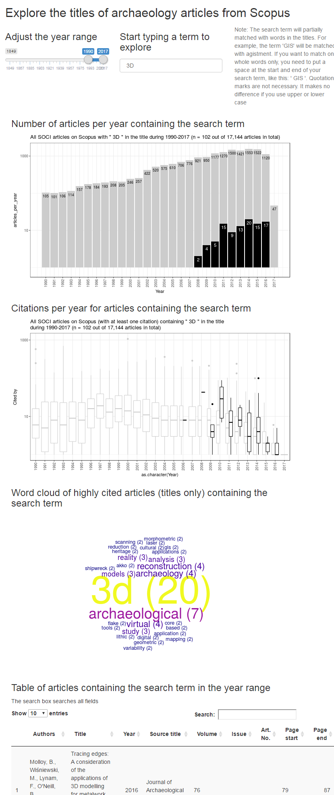

# Explore the titles of archaeology articles from Scopus

This [Shiny](http://shiny.rstudio.com/) application allows you to explore patterns in the use of keywords in journal articles about archaeological research. Currently you can explore the titles of about 18,000 articles. 

## How to run or install

There are three ways to run/install this app.

First, you can run it on the web at <https://benmarwick.shinyapps.io/scopusarchaeology/>. This is easy, free, and doesn't require you to download and install anything. It's also quite slow and a bit flaky. The second and third options for running the app locally give much better performance, but require a few downloads and a tiny bit more effort.

Second, you can run it on your computer. You'll need to install [R](https://cloud.r-project.org/) and [RStudio](https://www.rstudio.com/products/rstudio/download/). At the R prompt, run these lines:

```
if (!require("shiny")) install.packages("shiny") # checks to see if you have the shiny package, if not, it will be downloaded and installed
shiny::runGitHub("scopusarchaeology", "benmarwick")

```

Third, you can clone this repo to have the code on your computer, and run the app from there. This assumes you have [git](https://git-scm.com/), in addition to R and RStudio: you clone the repository from GitHub, open the .Rproj file in RStudio, then run this line at the R prompt:

```
shiny::runApp() # runs the app 
```

This app depends on several R packages (ggplot2, DT, dplyr, etc.). The app will check to see if you have them installed, and if you don't, it will try to download and install them for you.

## How to use

Run the app, and wait for it to appear in your webrowser, type in your keyword (one at a time), and wait for the plots to update. It may take a few seconds for the plots to update, please be patient. It will probably be much faster if you run the app locally on your computer. If it's working correctly it should look like this:

 

## Feedback and contributing

Please [open an issue](https://github.com/benmarwick/scopusarchaeology/issues/new) if you find something that doesn't work as expected. Note that this project is released with a [Guide to Contributing](CONTRIBUTING.md) and a [Contributor Code of Conduct](CONDUCT.md). By participating in this project you agree to abide by its terms.

## Licenses

Text: CC-BY-4.0 <http://creativecommons.org/licenses/by/4.0/>

Code: MIT <http://opensource.org/licenses/MIT> year: 2017, copyright holder: Ben Marwick

Data: This is a non-commercial, academic use of Elsevier data, as permitted by their [policy](https://dev.elsevier.com/policy.html).
